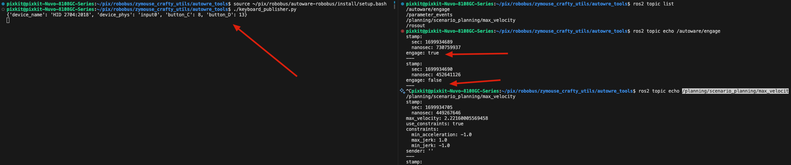
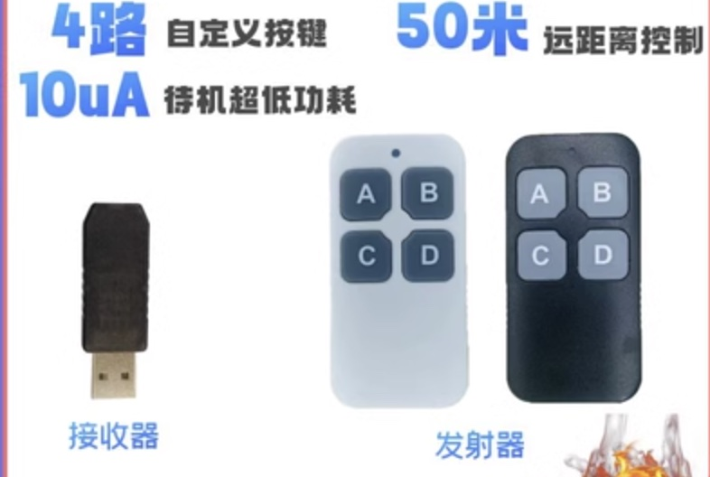

# 使用方法

## keyboard_publisher - 硬件按钮使能autoware

### 1.0 安装
```shell
python3 -m pip install evdev

```

### 使用方法
#### step-1：赋予权限
> `/dev/input/event12`根据上一步得到

```shell
sudo chmod 777 /dev/input/event*
```

#### step-2：获取设备信息并填写配置参数【不需要操作，直接进行step-2：运行脚本】
```shell
./get_evdev_info.py 
    device_path:/dev/input/event13
    device_name:HID 2704:2018
    device_phys:usb-0000:00:14.0-8/input1

    device_path:/dev/input/event12
    device_name:HID 2704:2018
    device_phys:usb-0000:00:14.0-8/input0
```
把`/input0`结尾到填写配置文件
比如：`device_name:HID 2704:2018`和`device_phys:usb-0000:00:14.0-8/input0`填写到参数文件`keyboard_publisher.yaml`


#### step-2：运行脚本
```shell
source autoware_robobus_install/setup.bash
./keyboard_publisher.py
```

#### step-3：执行成功效果图


#### 按钮介绍


- `A`: 下发autoware-engage: Ture 
- `B`: 下发autoware-engage: False 
- `C`: 下发autoware-velocity_limit: 8km/h （可以在`keyboard_publisher.yaml`修改） 
- `D`: 下发autoware-velocity_limit: 13km/h（可以在`keyboard_publisher.yaml`修改） 