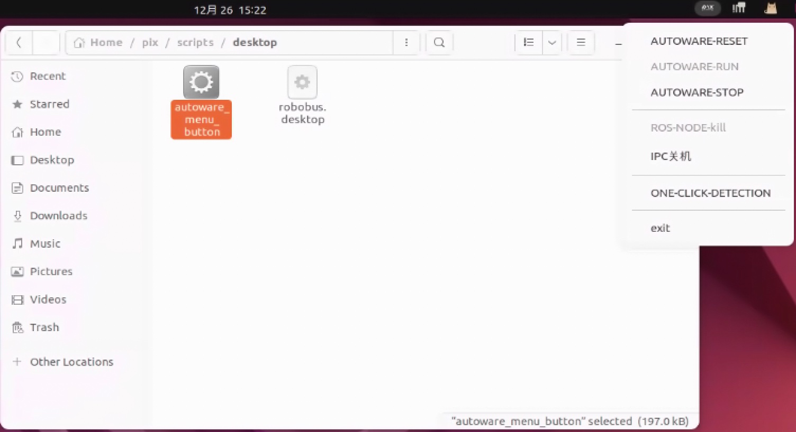

## 启动按钮

## 概述
    统一对autoware的启动和关闭行为，达到autoware稳定的启动和稳定的关闭，点击程序运行后，会在菜单栏产生一个小图标

## 使用说明
- `AUTOWARE-REST` : 检测是否可以启动autoware(本质就是检查是否有ros节点在运行)
- `AUTOWARE-RUN` : 启动autoware
- `AUTOWARE-STOP` : 关闭autoware
- `ROS-NODE-kill` : 如果遇见autoware无法关闭，也就是`AUTOWARE-REST`按钮总是失败时使用
- `ONE-CLICK-DETECTION` : 生成检查报告

