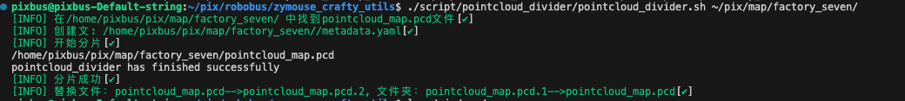

# 地图分片脚本

## 分片后文件

> 分片前
- lanelet2_map.osm                  `文件`
- map_projector_info.yaml           `文件`
- pointcloud_map.pcd                `文件`

> 分片后
- lanelet2_map.osm                  `文件`
- map_projector_info.yaml           `文件`
- pointcloud_map.pcd.2              `文件-备份`

- pointcloud_map.pcd                `文件夹`
- metadata.yaml                     `文件`
- pointcloud_map_metadata.yaml      `文件`


```shell
cd ~/pix/robobus/zymouse_crafty_utils
# 为factory_seven地图文件夹分片
./script/pointcloud_divider/pointcloud_divider.sh ~/pix/map/factory_seven/
```
> 成功图
